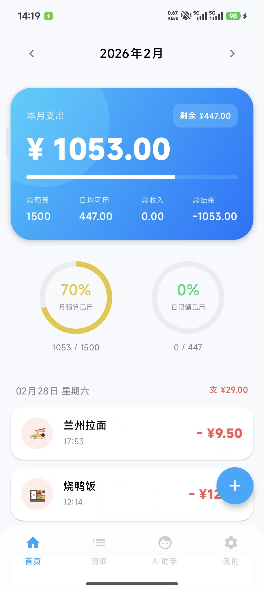
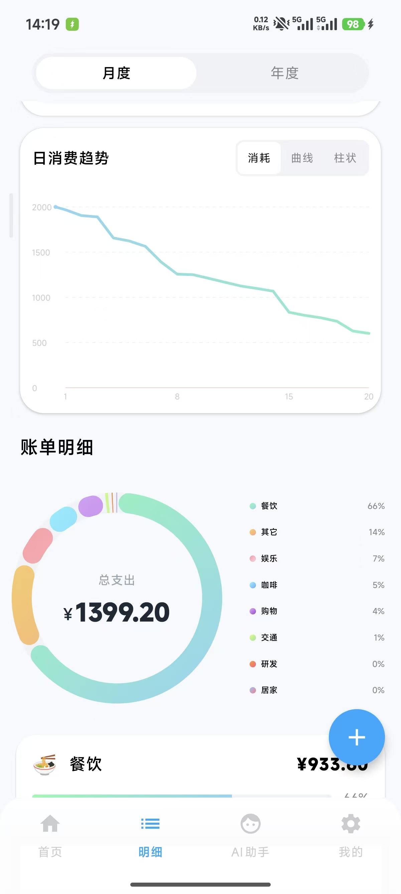
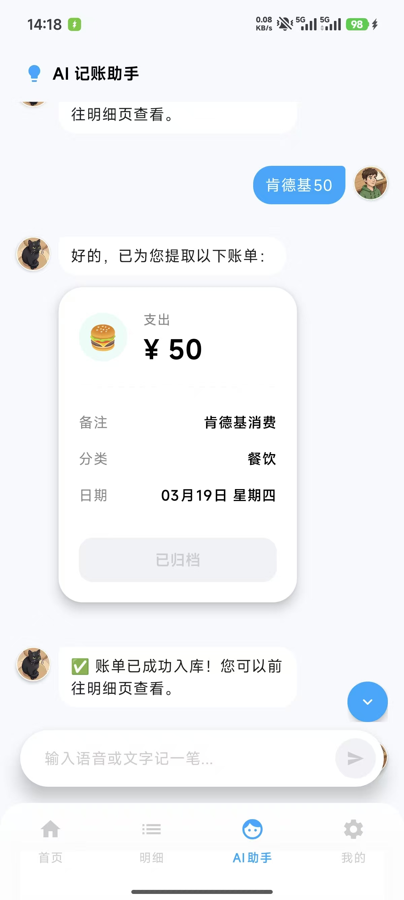
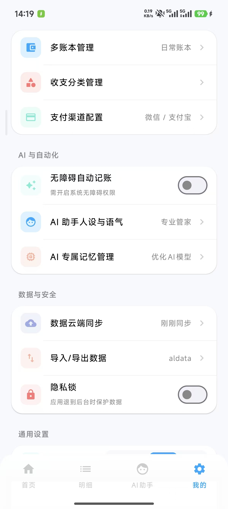

# 📊 AutoLedger — 智能 AI 自动记账助理

[](https://kotlinlang.org/)
[](https://developer.android.com/)
[](https://developer.android.com/compose)
[](https://dagger.dev/hilt/)

## 💡 写在前面的碎碎念 (About This Project)

> “不用再痛苦地手敲每一行样板代码，而是像导演一样指挥 AI 去构建应用。”

嘿，你好！欢迎来到 yhx 的 AutoLedger 的仓库。
这个项目是我通过 **Vibe Coding（AI 辅助编程）** 独立开发的一款 Android 自动记账 App。

一开始的初衷很简单：市面上的记账软件要么广告太多，要么记账流程太繁琐，而且很多功能都要VIP！！于是我想，能不能结合 Android 的无障碍服务（Accessibility）自动抓取账单，再配上大模型（LLM）来做智能分析？

所以，我借助于 Vibe Coding，我把主要的精力放在了**“产品架构设计”、“UI 审美把控”**以及**“核心业务逻辑的梳理”**上。从复杂的 Room 数据库多表关联，到酷炫的 Compose 双环形仪表盘，再到全局颜色的变量化重构，AI 帮我包揽了大量繁杂的代码编写工作。在这里，我是一个产品经理兼架构师，我只需要负责把整个项目打造为我喜欢的 漂亮！简洁！高级！而且好用的AI记账APP（后续会完善为AI+自动记账APP），而 AI 是我不知疲倦的超级码农。

无论你是对 Android 自动化记账APP感兴趣，还是对 Vibe Coding 的落地实践感到好奇，都欢迎在这里交流！

---

## 📱 核心界面展示与功能解析 (App Showcase)


### 🏠 1. 资产看板 (Home)
提供当月总收支与净资产的宏观概览，支持一键呼出极简的“快捷记账”底栏，结合平滑的动画呈现最新流水。
<br>


### 📈 2. 可视化明细 (detail)
数据可视化中心。由于没有采用第三方图表库，这里全量内置了通过 Canvas 自定义渲染的 **双环形仪表盘**、**精美饼图** 以及 **月/日趋势折线图**。用户可按时间或分类维度进行穿透式数据下钻;同时，不仅仅是传统的月度日历，我们还使用了类似 GitHub Contributions 的 **年度收支热力网格**。哪天消费高、哪天没花钱，你的财务活跃度一目了然。

<br>



### 🤖 3. 智能助理 (AI Chat) & 系统设置 (Settings)
**AI Agent** 支持 Persona（数字分身）管理，你可以预设不同的性格提示词，让 AI 读取本地账本并给出专业的财务建议。

<br>


### 💡 4. 系统设置 (Settings)
**系统设置** 则包含了AI性格管理，AI记忆管理，多账本管理、自定义收支分类、本地数据导入/导出、手势密码锁等基础设置。

<br>


---


## 🏗️ 架构设计与技术栈

本项目采用 **MAD (Modern Android Development)** 最佳实践，遵循MVVM的设计理念和开闭原则，以 **Clean Architecture** 为核心指导思想。

### 1️⃣ 层次化领域驱动设计
* **UI 表示层 (`ui.screens` / `ui.components`)**: 完全基于 **Jetpack Compose** 构建，沉淀了大量高复用的自定义 UI 资产。
* **状态控制层 (`viewmodel`)**: 业务状态机。利用 **Kotlin Coroutines + Flow** 处理所有用户交互意图。
* **资源协调层 (`data.repository`)**: 统一数据仓库，对上层屏蔽数据来源细节（本地 Room 或网络 API）。
* **基础设施层 (`data.dao` / `network`)**: 包含基于 **Room** 的本地 SQLite 持久化方案，以及基于 **Retrofit/OkHttp** 的网络层。
* **自动化引擎层 (`autobookkeeping`)**: 核心抓取模块，基于 Android `AccessibilityService` 动态解析屏幕节点数据自动入账。
* **环境装配层 (`di`)**: 利用 **Hilt** 在应用启动时完成底层单例组件的自动装配。

### 2️⃣ 核心技术选型
- **UI 框架**: Jetpack Compose
- **依赖注入**: Dagger-Hilt
- **异步编程**: Coroutines & Flow
- **本地存储**: Room Database
- **核心能力**: AI记账、Android Accessibility API (无障碍服务 on the way...）

---

## 🎨 全局颜色系统设计方案 (Design System)

为了打造极具品质感的视觉体验，AutoLedger 实现了高度工程化的 **“全变量抽取” (Total Variable Extraction)** 设计模式。

* 🧩 **语义化抽象**：所有的颜色（背景、表面、主色调、图表数据色等）在 `ui/theme/Color.kt` 中被抽象为独立常量，并在 `AppDesignSystem.kt` 中封装为语义化对象。
* 📐 **彻底解耦**：从基础页面到复杂的 `Canvas` 绘制图表组件，所有 UI 元素均调用这些语义变量，**杜绝硬编码颜色**。
* ⚡ **方案优势**：
    1. **单一事实来源**：修改一处变量，全端同步生效。
    2. **深色模式无缝切换**：配置一套暗色模式颜色映射表，即可零成本适配 Dark Mode。

---

## ⏳ 当前进度与路线图 (Roadmap)

### ✅ Phase 1: 本地核心界面与功能 (已完成)
- 全套基于 Compose 的现代化 UI 与自定义图表开发。
- Room 本地多表关联数据库设计及 MVVM 架构搭建。
- 全局变量化颜色系统、手势密码锁、本地数据导入导出。
- AI聊天式记账功能的完美实现，只需要给AI发聊天内容就可以自动记账哟。
- AI 助理的 Persona 设定与本地交互 UI 框架。

### 🚀 Phase 2: 线上服务器与代理部署 (开发中)
- **自动化引擎完善**：完成无障碍服务 (`AccessibilityService`) 对第三方支付平台的抓取与解析逻辑。
- **服务端基础设施**：搭建云端后端服务器，编写 RESTful API 与数据库交互逻辑。
- **云端同步与鉴权**：实现线上注册登录，以及本地 Room 数据与云端数据库的双向同步。
- **AI Agent 线上接入**：在服务端部署真实的 LLM 代理代码，处理客户端发来的自然语言记账与分析请求。

---

## 💻 如何使用与运行 (Usage Guide)

### 1. 环境准备
* **IDE**: Android Studio (推荐 Ladybug 或更高版本)
* **环境**: JDK 17
* **设备**: 搭载 Android 8.0 (API 26) 或更高版本系统的安卓手机，开启 USB 调试。

### 2. 拉取与编译
1. 克隆本仓库到本地：
   ```bash
   git clone https://github.com/haixin-ye/AutoLedger.git
   ```
2. 使用 Android Studio 打开项目文件夹，等待 Gradle 同步完成。
3. 编译打包：
    - 点击菜单栏 `Build` -> `Build Bundle(s) / APK(s)` -> `Build APK(s)` 即可生成安装包。
    - 或者连接手机后，直接点击顶部的 ▶️ **Run** 按钮进行安装。
---
